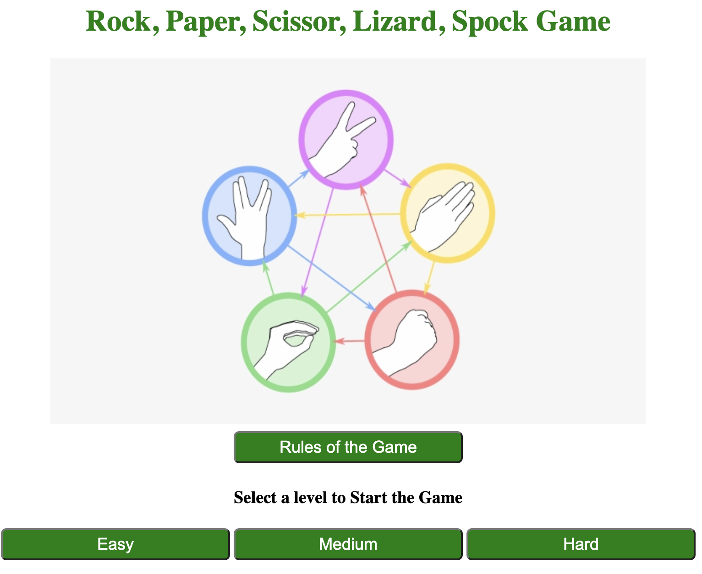
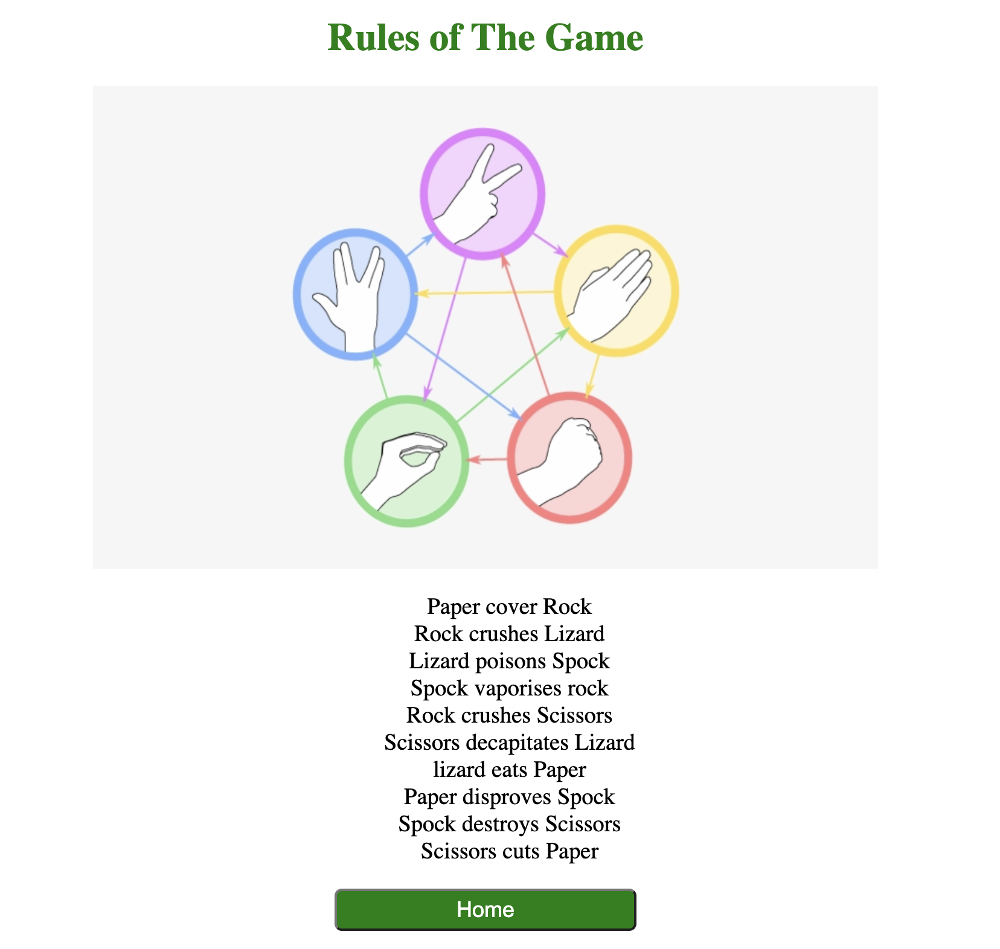
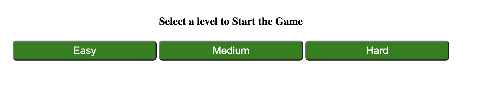
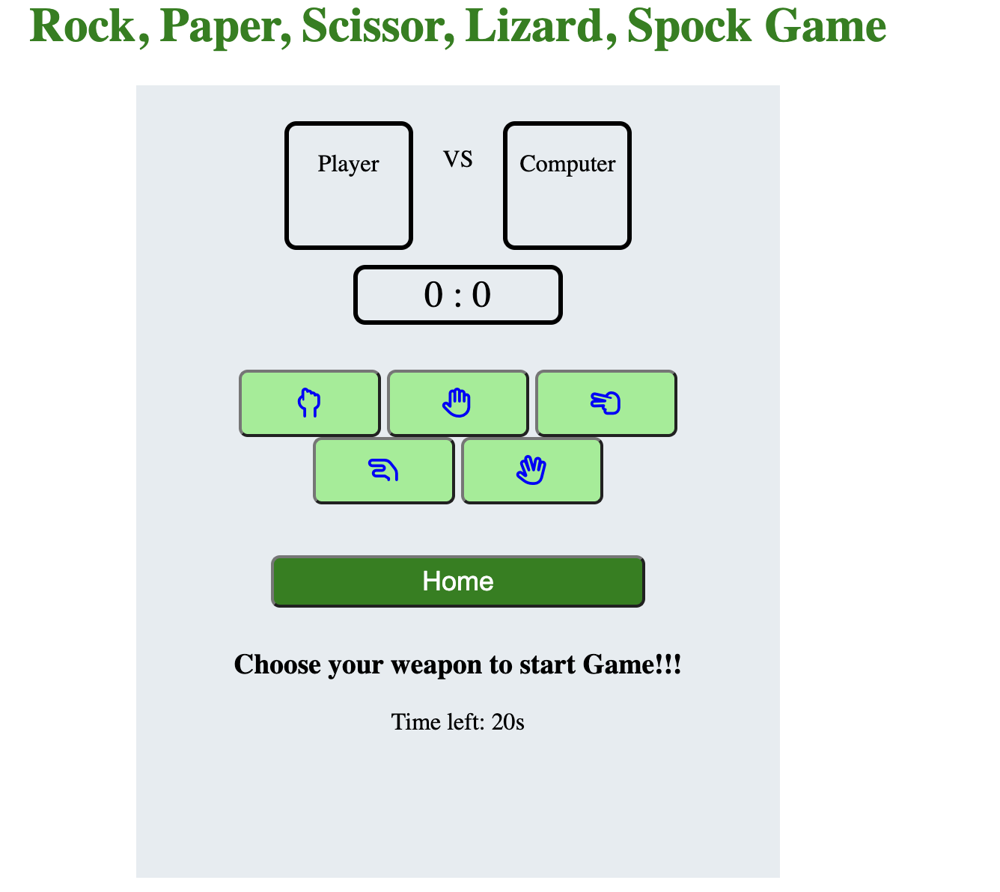
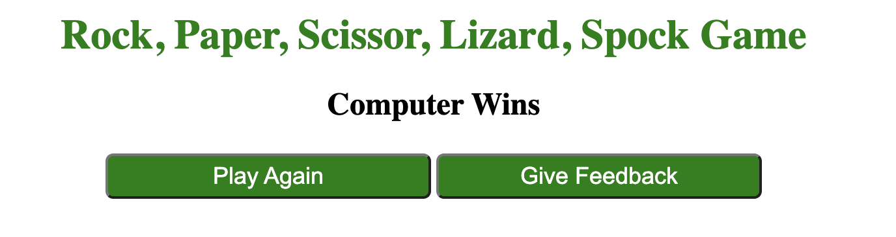
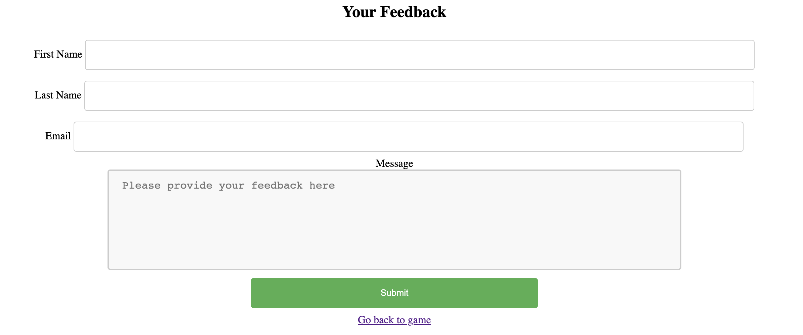
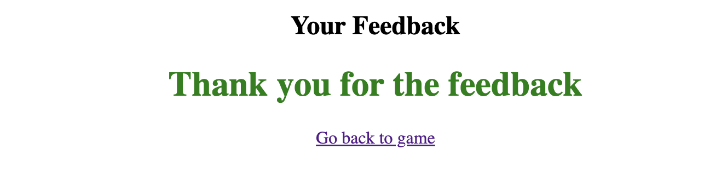
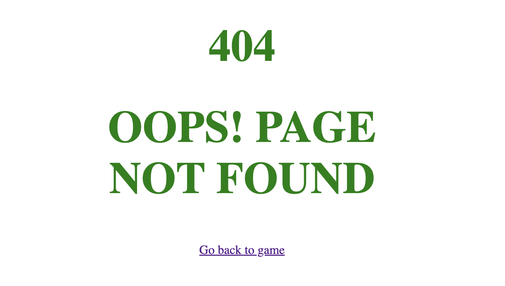

# Rock, Paper, Scissor, Lizard, Spock Game

(Developer: Morgan Asare)

[Visit live website](https://cleanoak.github.io/rock-scissor-game/)

## Table of Content

1. [Project Goals](#project-goals)
    1. [User Goals](#user-goals)
    2. [Site Owner Goals](#site-owner-goals)
2. [User Experience](#user-experience)
    1. [Target Audience](#target-audience)
    2. [User Requrements and Expectations](#user-requrements-and-expectations)
3. [Design](#design)
    1. [Design Choices](#design-choices)
    2. [Colour](#colours)
    3. [Fonts](#fonts)
    4. [Structure](#structure)
    5. [Wireframes](#wireframes)
4. [Technologies Used](#technologies-used)
    1. [Languages](#languages)
    2. [Frameworks & Tools](#frameworks-&-tools)
5. [Features](#features)
6. [Testing](#validation)
    1. [HTML Validation](#HTML-validation)
    2. [CSS Validation](#CSS-validation)
    3. [Accessibility](#accessibility)
    4. [Performance](#performance)
    5. [Device testing](#performing-tests-on-various-devices)
8. [Bugs](#Bugs)
9. [Deployment](#deployment)
10. [Credits](#credits)
11. [Acknowledgements](#acknowledgements)

## Project Goals

The goal of this project is to build an easy and intuitive  Rock, Paper, Scissors, Lizard, Spock game.

## User Goals

- Play an online game against the computer
- Play an online game that has an element of chance

## Site Owner Goals

- Create an online game which is intuitive and entertaining
- Create an online game to be played against the computer
- Create a simple navigation on the website
- Create a fully responsive and accessible website

## User Experience

### Target Audience

- Anyone who wants to be entertained by playing on the computer
- Anyone who enjoys guessing games

### User Requirements and Expectations

- Easy to understand and navigate
- Accessibility
- A responsive website that allows users to play across different devices
- Easy way to contact the developer with feedback

## User Stories

### Site User

1. I want to easily understand the game
2. I want to be able to choose a difficulty level
3. I want to be able to see real-time scores when playing with the computer
4. I want to know who won at the end of the game
5. I want to be able to contact the developer

### Site Owner

1. I want users to easily understand the game
2. I want users to easily navigate the game
3. I want the game to be fully responsive
4. I want the users to provide feedback after playing the game

## Design

### Colour Scheme

### Fonts

### Structure

### Wireframes

## Technologies Used

### Languages

- HTML
- CSS
- JAVASCRIPT

## Frameworks and Tools

- [Am I Responsive](http://ami.responsivedesign.is/) was used to create the multi-device mock-up you can see at the start of this README.md file.
- [EmailJS](https://www.emailjs.com) used to send email from the contact form
- [Favicon.io](https://favicon.io) for making the site favicon
- [Font Awesome](https://fontawesome.com/) - Icons from Font Awesome were used throughout the site
- [Git](https://git-scm.com/) was used for version control within VSCode to push the code to GitHub
- [GitHub](https://github.com/) was used as a remote repository to store project code
- [Google Fonts](https://fonts.google.com/)
- [Chrome dev tools](https://developers.google.com/web/tools/chrome-devtools) were used for debugging of the code and check site for responsiveness
- [WC3 Validator](https://validator.w3.org/), [Jigsaw W3 Validator](https://jigsaw.w3.org/css-validator/), [JShint](https://jshint.com/), [Wave Validator](https://wave.webaim.org/)
- [Lighthouse](https://developers.google.com/web/tools/lighthouse/) 
- [Am I Responsive](http://ami.responsivedesign.is/) were all used to validate the website

## Features

The website has 3 web pages with 8 features

### Home Screen

When the page loads, the home screen displays with the title boldly on top of the screen, a Rules Page and three buttons to show different difficult

See feature

### Rules Page 

The Rules Page displays the basic rules on how to play the game

See feature

### Select Game Level button

These buttons leads you to the selected difficulty level of the game

See feature

### Score Board

This page hides all the elements on the page to display the main game screen

See feature

### Game End page

This screen hides all other elements to display who won and allows you to go back to the game or give a feedback

See feature

### Feedback Page

This is a page that allows the user to contact the developer directly by filling a form submits via email

See feature

### Thank You Page

A short message of appreciation after feedback is sent

See feature

### 404 error page

- The site has a 404 error page which displays if the user enters a wrong URL
- Allows user to go back to the main page

See feature

## Validation

### HTML Validation

The html pages for this website was validated using [Nu Html Check](https://validator.w3.org/nu/) and no errors were found. 

* [Index page]()
* [feedback page](https://validator.w3.org/nu/?doc=https%3A%2F%2Fcleanoak.github.io%2Frock-scissor-game%2Ffeedback.html)
* [rules page](https://validator.w3.org/nu/?doc=https%3A%2F%2Fcleanoak.github.io%2Frock-scissor-game%2F404.html)
* [404 page](https://validator.w3.org/nu/?doc=https%3A%2F%2Fcleanoak.github.io%2Frock-scissor-game%2F404.html)

### CSS Validation

### JavaScript Validation

### Accessibility

### Performance

### Testing

## Deployment

### GitHub Pages
The website was deployed using GitHub Pages by following these steps:
1. In the GitHub repository navigate to the Settings tab
2. On the left-hand menu select Pages
3. For the source select Branch: main
4. Once saved, GitHub will refresh and your website will be published from the GitHub repository
5. The link to your published website will appear: "Your site is published at https://aleksandracodes.github.io/CI_PP2_SunshineGuessing/"

### Forking the GitHub Repository
1. Go to the GitHub repository
2. Click on the Fork button in the top right corner

### Making a Local Clone
1. Go to the GitHub repository 
2. Locate the Code button above the list of files and click it
3. Highlight the "HTTPS" button to clone with HTTPS and copy the link
4. Open Git Bash
5. Change the current working directory to the one where you want the cloned directory
6. Type git clone and paste the URL from the clipboard ($ git clone https://github.com/YOUR-USERNAME/YOUR-REPOSITORY)
7. Press Enter to create your local clone

