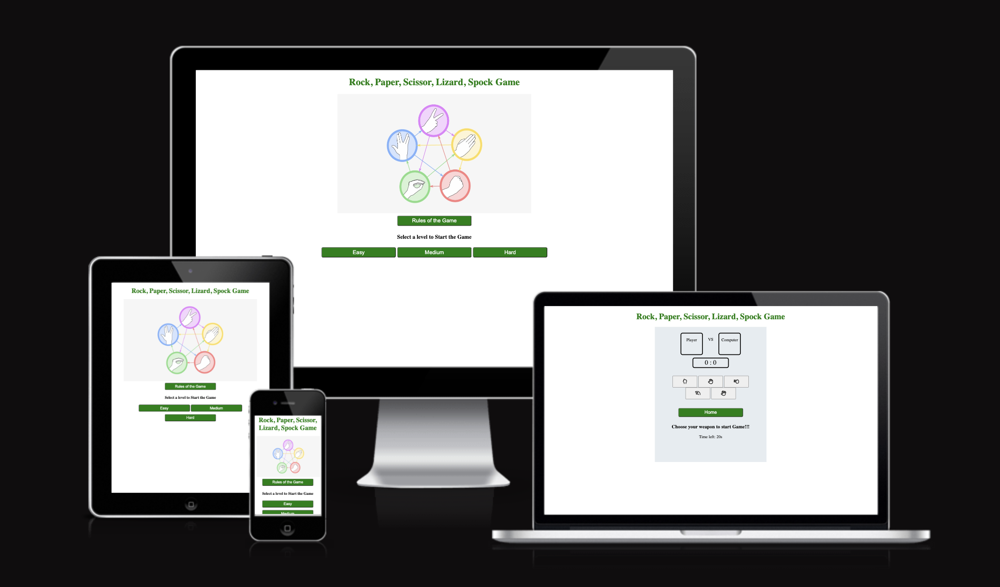

# Rock, Paper, Scissor, Lizard, Spock Game

(Developer: Morgan Asare)

[Visit live website](https://cleanoak.github.io/rock-scissor-game/)

## Table of Content

1. [Project Goals](#project-goals)
    1. [User Goals](#user-goals)
    2. [Site Owner Goals](#site-owner-goals)
2. [User Experience](#user-experience)
    1. [Target Audience](#target-audience)
    2. [User Requrements and Expectations](#user-requrements-and-expectations)
3. [Design](#design)
    1. [Design Choices](#design-choices)
    2. [Colour](#colours)
    3. [Fonts](#fonts)
    4. [Structure](#structure)
    5. [Wireframes](#wireframes)
4. [Technologies Used](#technologies-used)
    1. [Languages](#languages)
    2. [Frameworks & Tools](#frameworks-&-tools)
5. [Features](#features)
6. [Testing](#validation)
    1. [HTML Validation](#HTML-validation)
    2. [CSS Validation](#CSS-validation)
    3. [Accessibility](#accessibility)
    4. [Performance](#performance)
    5. [Device testing](#performing-tests-on-various-devices)
8. [Bugs](#Bugs)
9. [Deployment](#deployment)
10. [Credits](#credits)
11. [Acknowledgements](#acknowledgements)

## Project Goals

The goal of this project is to build an easy and intuitive  Rock, Paper, Scissors, Lizard, Spock game.

## User Goals

- Play an online game against the computer
- Play an online game that has an element of chance

## Site Owner Goals

- Create an online game which is intuitive and entertaining
- Create an online game to be played against the computer
- Create a simple navigation on the website
- Create a fully responsive and accessible website

## User Experience

### Target Audience

- Anyone who wants to be entertained by playing on the computer
- Anyone who enjoys guessing games

### User Requirements and Expectations

- Easy to understand and navigate
- Accessibility
- A responsive website that allows users to play across different devices
- Easy way to contact the developer with feedback

## User Stories

### Site User

1. I want to easily understand the game
2. I want to be able to choose a difficulty level
3. I want to be able to see real-time scores when playing with the computer
4. I want to know who won at the end of the game
5. I want to be able to contact the developer

### Site Owner

1. I want users to easily understand the game
2. I want users to easily navigate the game
3. I want the game to be fully responsive
4. I want the users to provide feedback after playing the game

## Design

### Colour Scheme

### Fonts

### Structure

### Wireframes

## Technologies Used

### Languages

- HTML
- CSS
- JAVASCRIPT

## Frameworks and Tools

## Features

## Validation

### HTML Validation

### CSS Validation

### JavaScript Validation

### Accessibility

### Performance

### Testing

